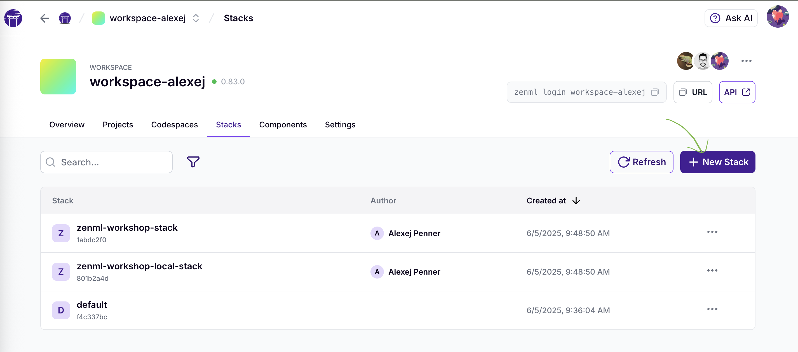
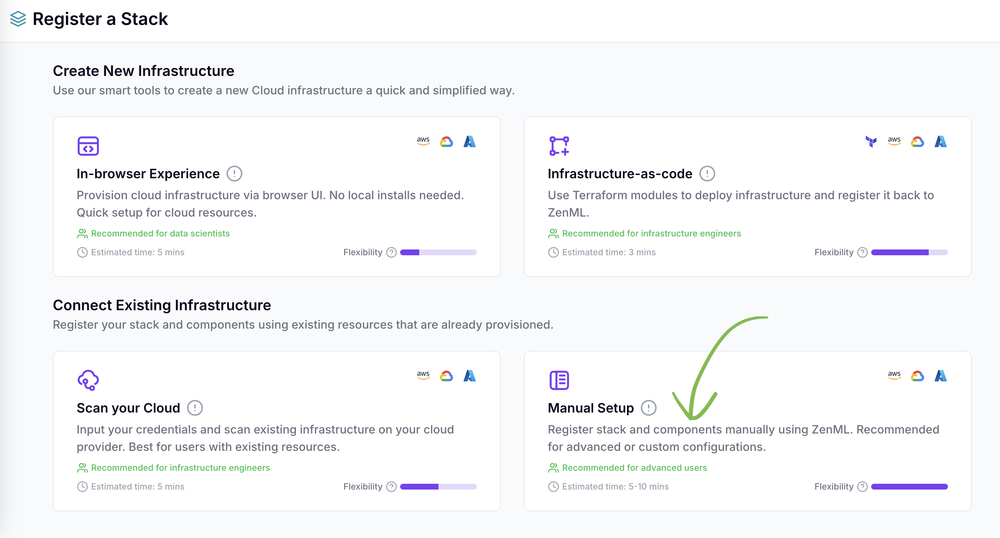
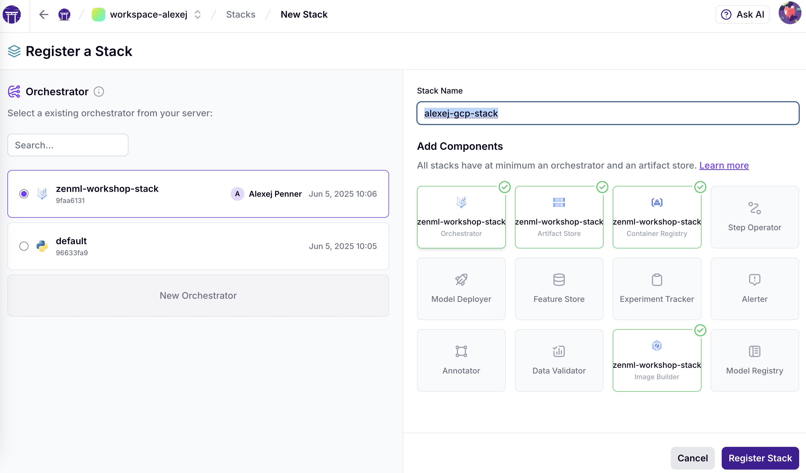
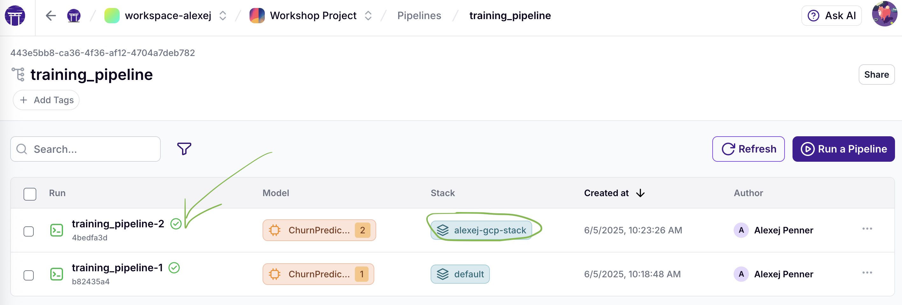
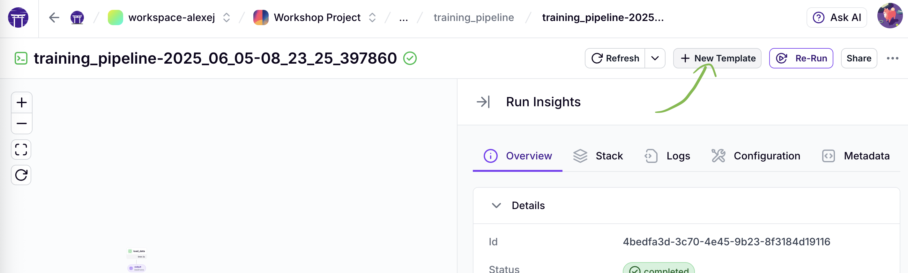
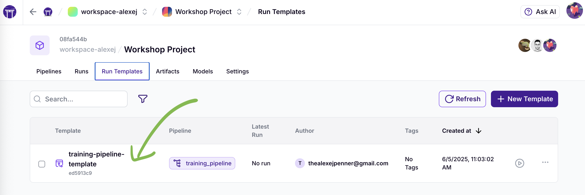
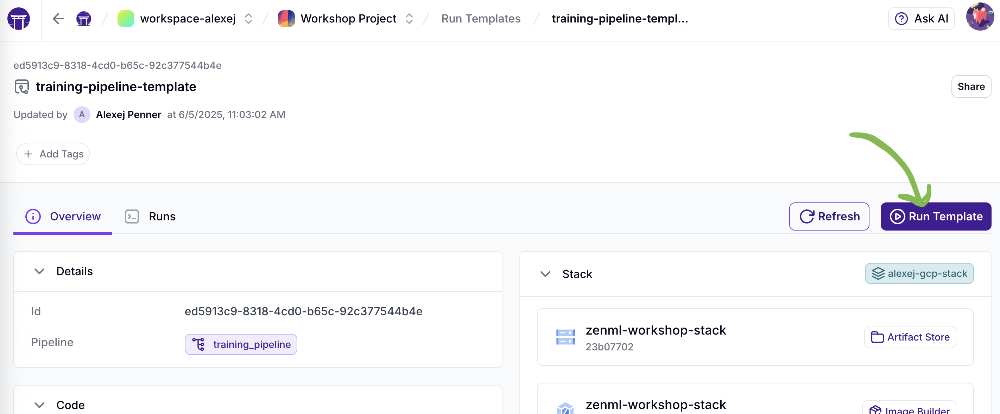
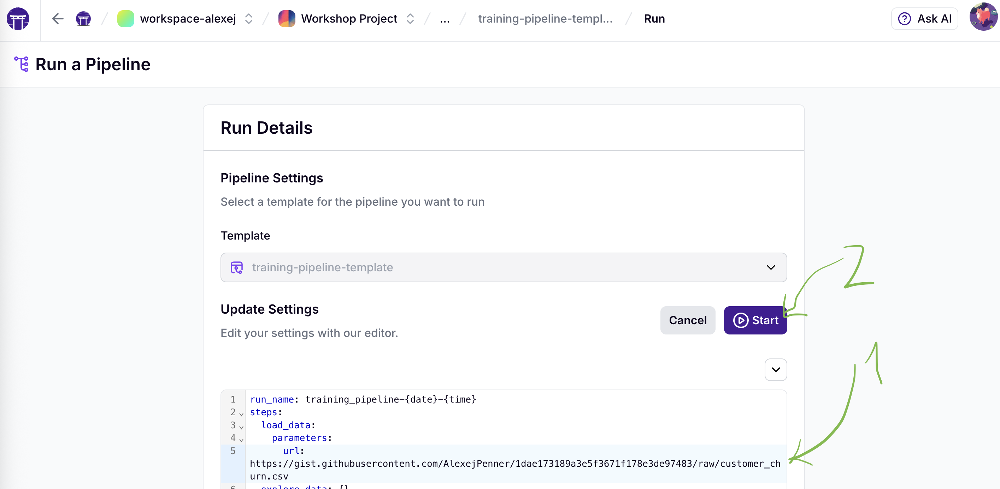
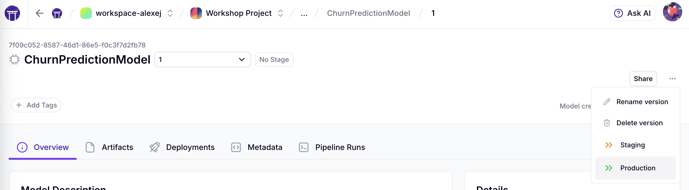

# ZenML Timeseries Forecasting Workshop

Convert traditional ML approaches into production-ready ZenML pipelines for timeseries forecasting! This workshop teaches you how to build clean, reproducible, and scalable MLOps workflows specifically designed for companies that forecast demand across thousands of products.

## 🎯 Workshop Objectives

By the end of this workshop, you will:

- **Understand the problems** with traditional approaches to timeseries forecasting at scale
- **Learn ZenML fundamentals** including steps, pipelines, and artifacts for forecasting
- **Build clean, structured ZenML timeseries pipelines** from scratch
- **Implement train-and-predict pipelines** with batch processing for multiple products
- **Experience batch processing patterns** that scale from workshop demos to production environments
- **Build forecast validation** with comprehensive metrics and reporting

## 📁 Workshop Structure

```
workshop-scaffold/
├── 📊 data/
│   ├── customer_churn.csv          # Legacy sample dataset 
│   └── generate_sample_data.py     # Legacy data generation script
├── 🔧 training_pipeline_scaffold.py    # Timeseries pipeline template (TODO)
├── ✅ training_pipeline_complete.py     # Complete timeseries solution (REFERENCE)
├── 🛠️ utils.py                         # Timeseries visualization utilities
├── 📦 requirements.txt             # All necessary dependencies
├── 🎨 assets/                      # Workshop screenshots and images
├── 🗂️ artifacts/                   # Generated pipeline artifacts
├── 🤖 models/                      # Legacy model files for reference
└── 📖 README.md                   # This file
```

## 🚀 Getting Started

### 1. Environment Setup

```bash
# Create a virtual environment (recommended)
python -m venv .venv
source .venv/bin/activate  # On Windows: venv\Scripts\activate

# Install dependencies
pip install uv
uv pip install -r requirements.txt

# Initialize ZenML
zenml init
zenml login
zenml integration install gcp github -y --uv
zenml stack set zenml-workshop-local-stack
```

### 2. Explore the Legacy Approach

Check out the existing `models/` directory to see examples of traditional ML artifact management:

```bash
# Look at the legacy model files
ls -la models/
# model_final_v2_actually_final_BEST.pkl  # Poor versioning example
# scaler_for_model_v2.pkl                 # Manual artifact management
# model_info_v2.txt                       # Unstructured metadata
```

**🔴 Notice the Problems with Traditional Timeseries Forecasting:**
- Hardcoded product lists and parameters
- Mixed feature engineering and modeling concerns  
- Poor model versioning (`model_final_v2_actually_final_BEST.pkl`)
- No batch processing for multiple products
- Manual artifact management
- No forecast validation pipeline
- Difficult to scale to thousands of products

## 📚 Workshop Activities

### Activity 1: Analyze the Legacy Approach (10 minutes)

Examine the existing `models/` and `artifacts/` directories and identify:
- How would you manage forecasting for 100,000 products with this approach?
- What happens when you need different forecast horizons for different products?  
- How would you track which products have poor forecast accuracy?
- How would you retrain models and maintain consistency?

### Activity 2: Convert to ZenML Training Pipeline (30 minutes)

Work on `training_pipeline_scaffold.py`:

### Activity 3: Create your production stack (10 minutes)

Now that your pipeline ran locally, let's try running it on a remote orchestrator - to do this, you need to create a new stack:



Go for the Manual stack creation


Pick the orchestrator, artifact store, image builder and container registry.



Finally go into your Terminal and set this new stack with:

```
zenml stack set <STACK NAME>
```

Now run your training pipeline again, and see what happens.

### Activity 4: Create a Run Template

Congratulations, you have run your pipeline in the remote environment. You can now create what is called a `Run Template` in ZenML. You can read more about them [here](https://docs.zenml.io/concepts/templates)

To create a run template, head on over to the dashboard and find the training pipeline that you just ran on your production stack.



Now just click on the "New Template" button on top, give it a name and create it.



Congrats, you now have a Run Template. You can now tie this into larger workflows by calling the ZenML API. You can also go through the dashboard, change the configuration as needed, an run the template. 

First navigate to the Run Templates section in your project ...



... open your template ...



.. and click on `Run Template`



1) You can now adjust the step parameters
2) ... and run it


### Activity 5: Scale the Batch Processing (15 minutes)

Experiment with scaling parameters in the complete pipeline:

```python
# Workshop configuration
timeseries_forecast_pipeline(
    n_products=10,      # Try 20, 50
    batch_size=5,       # Try 3, 7, 10
    forecast_horizon=30 # Try 7, 14, 60
)
```

**Observe:**
- How batch processing affects execution time
- Which products have better/worse forecast accuracy
- How validation metrics change with different parameters

### Activity 6: Promote Model for Production Use

In the ZenML dashboard, find your trained forecasting model and promote it to production:



This ensures you have control over which model version is used for forecasting, rather than always using the latest trained model.

### Activity 7: Compare and Reflect (10 minutes)

Compare the legacy approach with the ZenML pipeline:
- How does batch processing improve scalability?
- What's the benefit of comprehensive forecast validation?
- How does artifact tracking work for timeseries features?
- How would this deploy to production for 100,000+ products?

## 🏆 Key Learning Points

### Traditional Timeseries Forecasting Problems

| Problem | Example | Impact |
|---------|---------|---------|
| **No Batch Processing** | Process one product at a time | Doesn't scale to 100k products |
| **Mixed Concerns** | Feature engineering + modeling in one script | Hard to debug individual products |
| **Poor Versioning** | `model_final_v2_actually_final_BEST.pkl` | Can't track what changed between forecasts |
| **Manual Artifact Management** | `scaler_for_model_v2.pkl` | Inconsistent preprocessing across products |
| **No Forecast Validation** | Basic RMSE only | Can't identify which products are problematic |
| **No Scalability** | Fixed single-product approach | Can't handle enterprise forecasting loads |

### ZenML Timeseries Solutions

| ZenML Feature | Forecasting Benefit |
|---------------|---------|
| **Batch Processing Steps** | Scale to thousands of products efficiently |
| **Feature Engineering Pipeline** | Consistent lag/rolling features across all products |
| **Metadata Logging** | Track MAE, RMSE, R² for each experiment |
| **Artifact Versioning** | Automatic versioning of timeseries features and models |
| **Train-and-Predict Pipeline** | No separate inference pipeline needed |
| **Validation Steps** | Comprehensive forecast accuracy assessment |

## 🔍 Expected Outputs

After completing the workshop:

### ✅ Working Timeseries Forecasting Pipeline
- **Synthetic Data Generation**: 2 years of daily demand data for multiple products
- **Feature Engineering**: Lag features, rolling averages, temporal features  
- **Batch Processing**: Scalable product processing (5 products per batch in workshop)
- **Forecast Validation**: Comprehensive metrics (MAE, RMSE, R², MAPE)
- **Interactive Reports**: HTML dashboards with forecast visualizations

### ✅ Production-Ready Patterns
- **Scalable Architecture**: Ready for 100,000+ products with larger batch sizes
- **Train-and-Predict**: Single pipeline that trains and immediately forecasts
- **Validation Pipeline**: Post-prediction validation with detailed metrics
- **Experiment Tracking**: All metrics logged for comparison

### ✅ Better Forecasting Practices
- **Batch Processing**: Handle large product catalogs efficiently
- **Comprehensive Validation**: Multiple metrics to assess forecast quality
- **Artifact Tracking**: Version control for timeseries models and features
- **Production Scaling**: Clear path from workshop demo to enterprise deployment

## 🎓 Solutions

If you get stuck, check the complete solution:

- `training_pipeline_complete.py` - Fully implemented timeseries forecasting pipeline with batch processing

## 🚀 Running the Solutions

```bash
# Run the complete timeseries forecasting pipeline
python training_pipeline_complete.py

# View your pipeline runs
zenml pipeline runs list

# Explore artifacts (including forecast validation reports)
zenml artifact list

# Check interactive HTML reports in ZenML dashboard
zenml up
```

**Expected Console Output:**
```
🚀 Starting timeseries forecasting pipeline for 10 products...
📊 Generating timeseries data for 10 products...
✅ Generated 7300 records for 10 products
🔧 Preparing timeseries features...
✅ Training data: 6570 records
✅ Forecast data: 300 records
🌲 Training demand forecasting model...
✅ Demand forecasting model trained
🔮 Generating batch predictions (batch size: 5)...
  Processing batch 1/2: 5 products
  Processing batch 2/2: 5 products
✅ Completed 2 batches, 300 predictions generated
📊 Validating predictions...
📈 Validation Results:
  MAE: 15.23
  RMSE: 19.87
  R²: 0.892
  MAPE: 12.4%
```

## 🔧 ZenML Commands Reference

```bash
# Initialize ZenML
zenml init

# Login to ZenML
zenml login

# Set ZenML Stack
zenml stack set zenml-workshop-stack

# View pipelines
zenml pipeline list

# View pipeline runs
zenml pipeline runs list

# View artifacts
zenml artifact list

# View models
zenml model list

# Start ZenML dashboard
zenml up
```

## 📈 Next Steps After Workshop

1. **Add More Steps**: Data validation, feature engineering, model comparison
2. **Integrate MLflow**: For enhanced experiment tracking
3. **Add Deployment**: Using ZenML's deployment capabilities
4. **Set Up Monitoring**: Track model performance over time
5. **Cloud Integration**: Deploy to AWS, GCP, or Azure
6. **Team Collaboration**: Share pipelines and artifacts

## 💡 Production Considerations

### For Real-World Usage:

**Data Validation**
```python
@step
def validate_data(df: pd.DataFrame) -> pd.DataFrame:
    # Check schema, data quality, distributions
    return df
```

**Model Monitoring**
```python
@step  
def monitor_predictions(predictions: pd.DataFrame) -> dict:
    # Track prediction distributions, detect drift
    return monitoring_metrics
```

**A/B Testing**
```python
@step
def compare_models(model_a: Model, model_b: Model) -> Model:
    # Statistical comparison, champion/challenger
    return best_model
```

## 🆘 Troubleshooting

**Common Issues:**

1. **Import Errors**: Make sure you've installed all requirements
2. **File Not Found**: Run the data generation script first
3. **ZenML Not Initialized**: Run `zenml init`
4. **Permission Errors**: Check file permissions in working directory

**Getting Help:**
- ZenML Documentation: https://docs.zenml.io/
- ZenML Discord: https://zenml.io/slack-invite
- GitHub Issues: https://github.com/zenml-io/zenml/issues

## 🎉 Workshop Completion

Congratulations! You've learned how to:

✅ Identify problems in traditional ML workflows  
✅ Structure ML code using ZenML steps and pipelines  
✅ Implement artifact versioning and experiment tracking  
✅ Create production-ready training and inference pipelines  
✅ Experience the benefits of MLOps best practices  

**Keep learning**: Try applying these concepts to your own ML projects! 